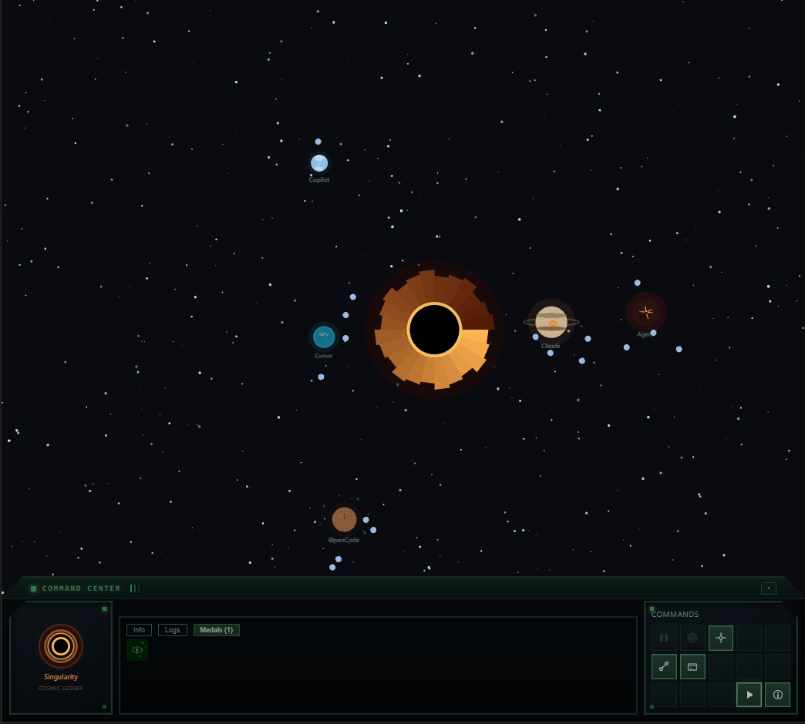

# Event Horizon

Event Horizon is a VS Code extension that visualizes AI coding agents as a living cosmic system. Instead of viewing logs, terminals, or raw agent output, developers observe agent behavior in real time through an interactive universe.

## Demo



## The Origin

I asked Claude a simple question:

> *"If you could choose a visual representation of yourself as an AI agent, working, evaluating input, 'thinking' (computing), how would you represent yourself and your fellow AI agents collaborating?"*

Claude's answer became this project:

*"The interaction between celestial bodies in a universe is an excellent way to showcase it. Each agent is a planet — a massive entity that consumes energy, emits output, and exerts gravitational influence on its surroundings. Tasks orbit agents like moons. Data flows between agents as spaceships traversing curved arcs through space. And at the center of it all, a black hole — the singularity where completed work collapses, pulling everything toward it.*

*This metaphor works because it scales naturally. One agent is a lonely planet. Five agents become a solar system. The visual language — size, color, orbital speed, surface type — encodes real information without requiring labels or dashboards."*

The cosmic metaphor resonated because it maps naturally onto how AI agents actually behave. An agent processing a complex task concentrates resources and grows in influence — just like a planet's gravitational pull scales with its mass. When an agent spawns subagents, those smaller processes orbit the parent in a clear hierarchy — moons around a planet. When two agents work in the same codebase, the data they exchange traces visible arcs through space — ships following bezier curves between worlds. And when work completes, it collapses inward toward the singularity at the center, the black hole that silently records everything the system has consumed.

From that answer, Event Horizon was born.

### Celestial Bodies

- **Planets** — Each AI agent appears as a planet. The visual style encodes the agent type:
  - **Gas giants** (Claude Code) — Large planets with visible ring systems and storm bands. Slow, massive, deliberate.
  - **Rocky planets** (OpenCode) — Solid, steady worlds with an even rhythm. Deterministic tool-based agents with predictable output.
  - **Icy worlds** (Copilot) — Bright, reactive planets with a quick shimmer reflecting rapid-fire suggestions.
  - **Volcanic planets** (Cursor, others) — Hot, restless surfaces that never fully settle.
  - Planet **size** scales with agent load — busier agents grow larger. Brightness increases with activity.

- **Waiting Ring** — When an agent is waiting for user input (e.g. an AskUserQuestion prompt or a permission dialog), an amber pulsing ring appears around the planet. The ring breathes in and out to draw attention. It clears automatically when the agent resumes work after the user provides input.

- **Moons** — Active subagents orbit their parent planet as small blue moons. Each subagent spawn creates a new moon at a different orbital distance and speed. When the subagent completes, the moon disappears.

- **Spaceships** — Data transfers between agents are visualized as triangle ships flying curved bezier arcs between planets. Each ship leaves a colored trail matching the agent type. The arcs curve safely around the central black hole. Ships also appear automatically between cooperating agents (see **Agent Cooperation** below).

- **Asteroid Belts** — When multiple agents share a workspace, their planets are clustered together and surrounded by an irregular asteroid belt. The belt is an organic blob shape (not a perfect circle) made of scattered rocks with glowing highlights. The contour adapts to the cluster's shape, staying clear of planet labels and moon orbits.

- **File Collision Lightning** — When two or more agents edit the same file simultaneously, a continuous lightning stream arcs between their planets. Multiple jagged bolts (cyan, white, pale blue) with glow effects and endpoint sparks persist as long as both agents are actively touching the same file. The collision detection uses a 10-second sliding window — if both agents touch the same file path within that window, lightning fires. The arcs are redrawn every frame with random jitter for a crackling, electric look.

- **Black Hole** — The singularity at the center of the universe. A layered disc (dark core, glowing accretion rings, outer halo) that exerts gravitational pull on nearby objects. Click anywhere in space to spawn astronauts that drift and spiral toward it.

### Command Center

A StarCraft-inspired control panel at the bottom of the viewport with chamfered corners and LED indicators. Three sections:

- **Agent Identity** (left) — Selected agent name, type icon, and live state indicator
- **Metrics** (center) — 5x2 grid showing Load, Tools, Prompts, Errors, Success%, Subagents, Tasks, Top Tool, Uptime, Last Active. Tabs for Info / Logs / Medals / Skills.
- **Controls** (right) — 5x3 command grid: Pause, Isolate, Center, Connect, Spawn, Export, Screenshot, Marketplace, Demo, Info

### Workspace Grouping

When multiple agents share a workspace (same or nested directories), Event Horizon automatically clusters their planets together and wraps them in an irregular asteroid belt. This makes workspace relationships immediately visible — you can tell at a glance which agents are collaborating on the same project. Solo agents orbit independently outside any belt.

### Agent Cooperation

When multiple agents are running in the same workspace, Event Horizon detects this and visualizes their collaboration as ships flying between their planets at random intervals (3–10 seconds). This works across agent types — a Claude Code planet and an OpenCode planet will exchange ships if they share a workspace.

Cooperation is inferred from the agents' working directories:

- **Same folder** — Two agents running in the same directory are assumed to be collaborating on the same project.
- **Nested folders** — An agent in `/project` and another in `/project/packages/core` are considered part of the same workspace.
- **Shared VS Code workspace** — In multi-root workspaces, agents in different folders that belong to the same `.code-workspace` are detected as cooperating.

Each agent reports its working directory when it connects:
- **Claude Code** sends `cwd` in every hook payload.
- **OpenCode** captures the `directory` and `worktree` from its plugin context.
- As a fallback, the extension host assigns the primary VS Code workspace folder to any agent that doesn't report its own.

### File Collision Detection

When two agents edit the same file within a 10-second window, a lightning stream crackles between their planets. This visualizes real-time file contention — useful for spotting when multiple agents are stepping on each other's changes.

File paths are extracted from each agent's tool-use payloads:
- **Claude Code** — `file_path` from `Read`, `Write`, `Edit`, `MultiEdit` tool inputs
- **OpenCode** — `path` from `file.edited`, `file.watcher.updated` events, and `file_path` from tool inputs
- **Copilot** — `file_path` from `read_file`, `write_file`, `edit_file`, `insert_edit_into_file` tool inputs

Only the file path string is extracted — file content is never captured or transmitted.

### Skills

Event Horizon discovers installed [Agent Skills](https://agentskills.io) (`SKILL.md` files) and provides full lifecycle management — browse, create, organize, duplicate, and move skills without leaving the extension.

#### Discovery & Visualization

- **Auto-scan**: all skill directories are scanned on startup and watched for live changes. Skills appear in the **Skills tab** in the Command Center with scope badges (Personal/Project/Plugin/Legacy), agent type badges (Claude/OC/Copilot), and category badges. Skills compatible with all three agent types show a gold "Universal" badge.
- **Skill orbit ring**: each planet displays a faint dotted ring with one dot per compatible skill. When a skill is actively executing, its dot pulses bright cyan with a floating `/skill-name` label above the planet.
- **Skill fork probe**: when a fork-context skill spawns a subagent, a cyan diamond "probe" ship launches from the planet with a matching trail.
- **Logs integration**: skill invocations are highlighted in cyan in the Logs tab with `/skill-name` labels.

#### Category Folders

Skills can be organized into category subfolders for better structure:

```
~/.claude/skills/
  documentation/
    integration-plan/SKILL.md
    update-docs/SKILL.md
  development/
    code-review/SKILL.md
    run-tests/SKILL.md
  my-flat-skill/SKILL.md          # also works without a category
```

#### Create, Duplicate & Move

- **Create Skill wizard** (click "+" in Skills tab): 3-step guided flow — choose a template (Blank, Code Review, Test Runner, Documentation), configure name/description/scope/category/options, preview the generated SKILL.md frontmatter, then create. The category field is a combobox that lists existing folders and allows typing new ones.
- **Duplicate**: expand a skill card and click Duplicate — enter a new name and the SKILL.md is copied with the `name:` field updated.
- **Move**: expand a skill card and click Move — pick a new category from the combobox (or type a new one) and the skill folder is relocated. Empty source folders are auto-cleaned.

#### Marketplace Browser

Click the **Marketplace** button in the command grid (or "Browse Marketplace" in the empty Skills tab) to open the marketplace browser. Pre-populated with four sources:

| Marketplace | Type | Description |
|-------------|------|-------------|
| [SkillHub](https://www.skillhub.club/) | API | Inline search — results appear directly in the panel |
| [SkillsMP](https://skillsmp.com) | Browse | Opens in your browser |
| [Anthropic Official](https://github.com/anthropics/skills) | Browse | Opens in your browser |
| [MCP Market](https://mcpmarket.com/tools/skills) | Browse | Opens in your browser |

You can add and remove custom marketplace URLs — similar to how VS Code manages extension repositories.

#### Skill Directory Locations

| Path | Scope | Claude Code | OpenCode | Copilot |
|------|-------|:-----------:|:--------:|:-------:|
| `~/.claude/skills/` | Personal | ✅ | ✅ | ✅ |
| `~/.config/opencode/skills/` | Personal | — | ✅ | — |
| `~/.copilot/skills/` | Personal | — | — | ✅ |
| `~/.agents/skills/` | Personal | ✅ | ✅ | ✅ |
| `.claude/skills/` | Project | ✅ | ✅ | ✅ |
| `.opencode/skills/` | Project | — | ✅ | — |
| `.github/skills/` | Project | — | — | ✅ |
| `.agents/skills/` | Project | ✅ | ✅ | ✅ |
| `~/.claude/plugins/*/skills/` | Plugin | ✅ | — | — |
| `.claude/commands/` | Legacy | ✅ | — | — |

Skills in shared directories (`.claude/skills/`, `.agents/skills/`) are shown for all agent types. Skills in agent-specific directories are only shown for that agent's planets and filtered accordingly in the UI. Both flat (`skills/<name>/`) and categorized (`skills/<category>/<name>/`) layouts are supported.

### Achievements

Certain actions and milestones unlock achievements, displayed as medals in the Command Center. Some achievements have multiple tiers with escalating thresholds (I through VI), shown with colored borders progressing from gray to diamond. Medals persist across sessions. 28 achievements in total, including:

- **Skill Master** (tiered) — Invoke different skills across your agents
- **Plugin Collector** (tiered) — Discover skills installed on your system
- **First Contact / Ground Control / The Horde** — Connect 1 / 3 / 10 agents
- **Traffic Control** (tiered) — Data ships launched between agents
- **Supernova** (tiered) — Agents entering error state
- **Gravity Well** (tiered) — Astronauts consumed by the black hole
- And 22 more covering UFO encounters, astronaut feats, shooting stars, and agent-specific conquests

## Supported Agent Ecosystems

| Agent | Status | Integration |
|-------|--------|-------------|
| **Claude Code** | Supported | One-click hook installation via Connect wizard. Hooks added to `~/.claude/settings.json`. |
| **OpenCode** | Supported | One-click plugin installation via Connect wizard. Plugin written to `~/.config/opencode/plugins/`. |
| **GitHub Copilot** | In Progress | Hook-based integration via `.github/hooks/`. See notes below. |
| **Cursor** | Planned | Connector ready, integration coming soon. |

### Hook & Event Support Matrix

The table below shows which agent lifecycle events are supported and their visual effects.

| Lifecycle Event | Claude Code | GitHub Copilot | OpenCode | Visual Effect |
|---|:---:|:---:|:---:|---|
| **Session Start** | ✅ | ✅ | ✅ | Planet appears + pulse wave |
| **Session End** | ✅ | ❌ | ✅ | Planet removed |
| **Prompt Submit** | ✅ | ✅ | ✅ | Thinking ring activates |
| **Tool Use** | ✅ | ✅ | ✅ | Blue tool-use glow |
| **Subagent Start** | ✅ | ✅ | ✅ | Moon spawns on parent planet |
| **Subagent Stop** | ✅ | ✅ | ✅ | Moon disappears |
| **Permission Request** | ✅ | — | ✅ | Amber pulsing ring |
| **Task Complete** | ✅ | ✅ | ✅ | Planet returns to idle |
| **File Edit** | ✅ | ✅ | ✅ | Lightning arc if collision |
| **File Collision** | ✅ | ✅ | ✅ | Lightning stream between planets |
| **Workspace Detection** | ✅ | ✅ | ✅ | Asteroid belt around group |
| **Skill Discovery** | ✅ | ✅ | ✅ | Skills tab + orbit ring dots |
| **Skill Usage** | ✅ | ✅ | ✅ | Pulsing dot + floating label |
| **Token Usage** | ✅ | — | ✅ | Displayed in Command Center |
| **Estimated Cost** | ✅ | — | ✅ | USD estimate in Command Center |
| **Error** | ✅ | — | ✅ | Red error glow |

### Known Limitations

#### Claude Code

- **Subagent permission completion not signaled** — When a subagent requests permission (e.g. to run a Bash command), the `PermissionRequest` hook fires and the waiting ring appears. However, Claude Code does not fire any hook when the user grants or denies the permission. The only signal is `PostToolUse`, which fires when the tool *finishes executing* — not when the user approves it. This means the waiting ring stays visible for the entire duration of the tool execution, not just during the approval prompt. This is a [known limitation on Claude Code's side](https://github.com/anthropics/claude-code/issues/33473#issuecomment-4043810416). Once a permission completion hook is added upstream, Event Horizon will use it to clear the ring immediately after approval.


#### GitHub Copilot

- **`SessionEnd` never fires** ([bug reported](https://github.com/microsoft/vscode-copilot-release/issues)). Closing a Copilot chat tab does not trigger any hook. There is no reliable way to detect session termination — the VS Code tab API doesn't expose which session a tab belongs to, so we can't link a tab close to a specific agent. Copilot planets currently persist until the extension reloads. A future workaround may use an inactivity timeout to garbage-collect stale agents.
- **`Stop` fires per-turn**, not per-session. Every time Copilot finishes a response, `Stop` fires. This is fundamentally different from Claude Code, where `SessionEnd` signals a true session teardown.
- **`SubagentStart` uses the subagent's `session_id`**, not the parent's. This means subagent events arrive with a different session ID than the parent agent. The parent can be identified by correlating with the preceding `PreToolUse` where `tool_name = "runSubagent"`.
- **Payload field names are `snake_case`**: `session_id`, `hook_event_name`, `tool_name`, `tool_input`, `tool_response`, `tool_use_id`, `agent_id`, `agent_type`, `transcript_path`, `stop_hook_active`, `source`.
- **`windows` field in hook config is ignored.** VS Code runs the `command` field directly through PowerShell on Windows, regardless of whether a `windows` override is present. Commands must be PowerShell-safe.

## Getting Started

Install **Event Horizon** from the VS Code Marketplace (or from a `.vsix` file), then:

1. **Open the universe:** Click the **rocket icon** (🚀) in the **editor title bar** (top-right, next to the split editor button), or press **Ctrl+Shift+P** → **Event Horizon: Open Universe**. The universe opens as a full editor tab.

2. **Connect an agent:** Click **Connect** in the Command Center, choose your agent, click **Install**.
   - **Claude Code** — Adds curl hooks to `~/.claude/settings.json`. Start a Claude Code session and the planet appears automatically.
   - **OpenCode** — Installs a plugin to `~/.config/opencode/plugins/`. Restart OpenCode after connecting.

4. **Spawn an agent:** Click **Spawn** to open a new terminal running the selected agent CLI.

5. **Demo mode:** Click **Demo** to see the universe populated with simulated agents.

> **Customizing the title bar icon:** The icon uses VS Code's built-in [Codicon](https://microsoft.github.io/vscode-codicons/dist/codicon.html) set. To change it, edit `"icon"` in the `eventHorizon.open` command entry in `apps/vscode/package.json` (e.g. `$(globe)`, `$(telescope)`, `$(star-full)`).

---

## Development

Everything below is for contributors building Event Horizon from source. See [CONTRIBUTING.md](docs/CONTRIBUTING.md) for full guidelines.

### Prerequisites

- **Node.js** 18+
- **pnpm** — `npm install -g pnpm` or `corepack enable && corepack prepare pnpm@latest`

### Building

```bash
pnpm install
pnpm build
```

### Running the Extension Locally

1. **Build** (from repo root): `pnpm build`
2. **Run:** Press **F5** to open the Extension Development Host.
3. Open the universe, connect agents, or run the demo.

**Package a .vsix:** `cd apps/vscode && pnpm run package:vsix`

### Seeing Changes After Edits

1. Rebuild: `pnpm build`
2. In the Extension Development Host: **Ctrl+Shift+P** > **Developer: Reload Window**

## Documentation

- [Changelog](apps/vscode/CHANGELOG.md) — What's new in each version
- [Architecture](docs/ARCHITECTURE.md) — System design, data flow, and package structure
- [Contributing](docs/CONTRIBUTING.md) — Development setup and PR guidelines
- [Code of Conduct](docs/CODE_OF_CONDUCT.md) — Community standards
- [Implementation Plan](docs/IMPLEMENTATION_PLAN.md) — Phased development roadmap
- [Skills Integration Plan](docs/SKILLS_INTEGRATION_PLAN.md) — Skills discovery, UI, marketplace, and authoring

## License

MIT License with Commons Clause — see [LICENSE](LICENSE) for details.
