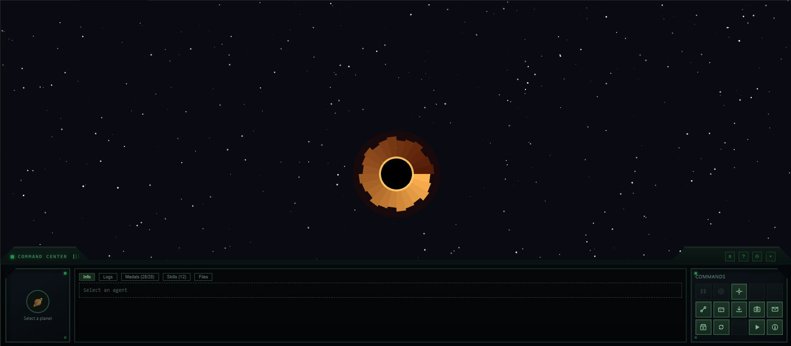
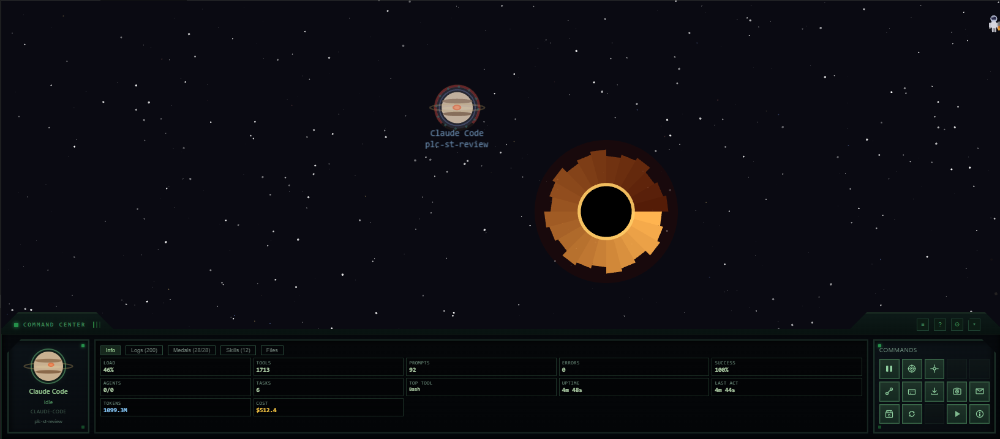

# Getting Started

This page takes you from a fresh install to a connected agent appearing as a planet. It should take about two minutes.

---

## 1. Install the extension

Event Horizon is published to two registries so it works in every VS Code-compatible editor.

=== "VS Code"

    1. Open the **Extensions** view (++ctrl+shift+x++)
    2. Search for **Event Horizon**
    3. Click **Install** on the entry by **HeytalePazguato**

    Or install from the [Marketplace page](https://marketplace.visualstudio.com/items?itemName=HeytalePazguato.event-horizon-vscode).

=== "Cursor / VSCodium / Windsurf / others"

    These editors use the **Open VSX** registry:

    1. Open the Extensions view
    2. Search for **Event Horizon**
    3. Install the entry by **HeytalePazguato**

    Or install from the [Open VSX page](https://open-vsx.org/extension/HeytalePazguato/event-horizon-vscode).

=== "Manual (.vsix)"

    1. Download the latest `.vsix` from the [GitHub Releases page](https://github.com/HeytalePazguato/event-horizon/releases)
    2. In VS Code: **Extensions** view → **⋯** menu → **Install from VSIX…**
    3. Select the downloaded file

There is nothing to configure after install. The extension activates automatically.

---

## 2. Open the Universe

Three ways to open the panel:

- Click the **rocket icon** in the top-right of any editor tab
- Press ++ctrl+shift+e++ then ++h++ (on macOS: ++cmd+shift+e++ then ++h++)
- Run **Event Horizon: Open Universe** from the Command Palette (++ctrl+shift+p++)

The universe starts empty — a dark sky with stars and a black hole at the center. Planets appear as agents connect.

---

## 3. Connect an agent

Click **Connect** in the Command Center control grid (bottom-right of the panel) to open the connection wizard. Pick your agent and click **Install**.

| Agent | What gets installed | Where |
|-------|--------------------|----|
| **Claude Code** | A hook entry | `~/.claude/settings.json` |
| **OpenCode** | A plugin file | `~/.config/opencode/plugins/` |
| **GitHub Copilot** | Hook scripts | `.github/hooks/` in your workspace |
| **Cursor** | Hook configuration | Cursor's config |

The wizard writes the hook for you — you don't edit any files by hand. Hooks are also **re-checked and updated on every activation**, so once connected you stay connected across updates.

For agent-specific details, edge cases, and troubleshooting, see the per-agent guides:

- [Claude Code setup](setup/claude-code.md)
- [OpenCode setup](setup/opencode.md)
- [GitHub Copilot setup](setup/copilot.md)
- [Cursor setup](setup/cursor.md)

!!! tip "Auto-detection"
    On activation, Event Horizon scans your `PATH` for installed agent CLIs (`claude`, `opencode`, `cursor`) and offers one-click setup for any it finds without hooks. You can disable this with [`eventHorizon.autoDetect.enabled`](configuration.md#eventhorizonautodetectenabled).

---

## 4. Start coding

Start a session with your connected agent — in a terminal, the sidebar, wherever you normally run it. Within a second or two, **its planet appears in the universe.**

- Run a prompt → the planet shows a **pulsing ring** (thinking)
- The agent calls a tool → activity registers on the planet and in the event log
- The agent finishes and waits for you → an **amber breathing ring** appears

Click the planet to select it. The [Command Center](command-center.md) fills in with its name, type, state, and live metrics.

---

## 5. Try the demo (optional)

Want to see the full universe — ships, lightning arcs, multiple planets, achievements — without connecting real agents?

Click **Demo** in the control grid. Event Horizon runs a simulation with fake agents that spawn, work, cooperate, and collide. It's the fastest way to learn what every visual means. Turn it off by clicking **Demo** again.

---

## Next steps

-   :material-earth: **[The Universe](the-universe.md)** — what every planet, ship, and gauge means

-   :material-view-dashboard: **[Command Center](command-center.md)** — the control panel at the bottom of the view

-   :material-account-group: **[Multi-Agent Orchestration](orchestration.md)** — run a team of agents from a single plan

-   :material-cog: **[Configuration](configuration.md)** — all 35 settings

